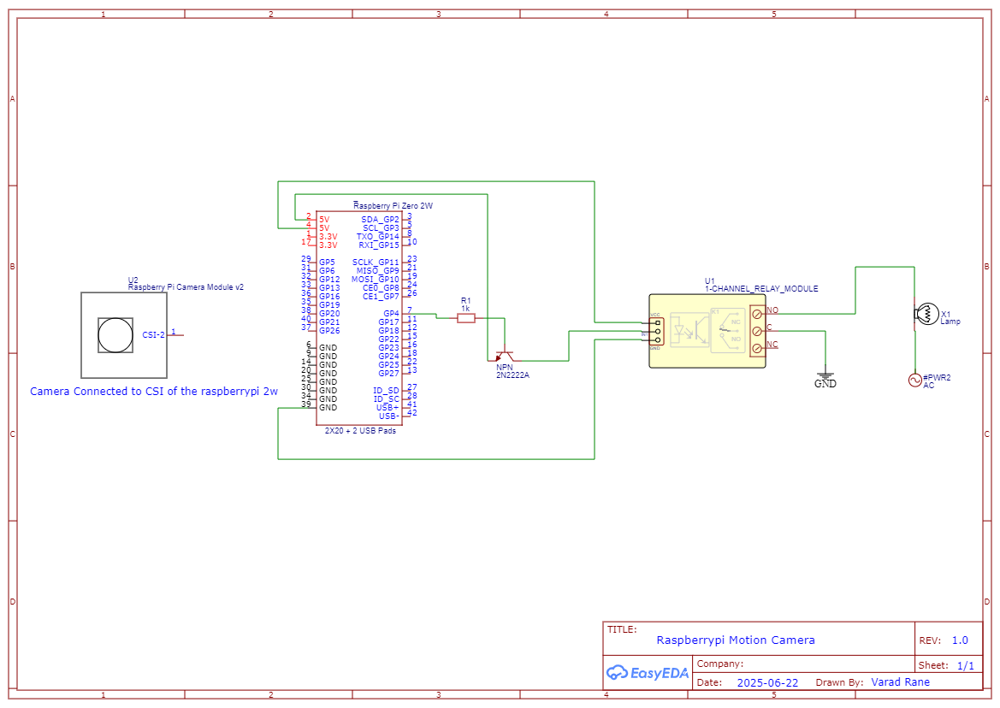

# Motion‑Activated Security Camera

A DIY **motion-triggered surveillance system** using **Raspberry Pi** and **Esp-01**. Captures video/images on motion, uploads to AWS or stores locally, and is controlled through a web dashboard using Flask. Secured remote access via **Cloudflare Tunnel**.

---

## Features

- Motion-triggered video/image capture
- Flask web interface (accessible remotely)
- AWS S3 integration for cloud storage
- Esp-01-based relay logic for:
  - Light automation
  - Remote doorbell
- Timed light switch control
- Remote doorbell triggering
- Remote pause/resume of motion detection
- Real-time Discord alert logging (motion, doorbell, errors)

---

## Project Structure
```bash
Motion-Activated-Security-Camera/
├── flask/                  # Flask backend for UI and API endpoints
├── ESP_CODES/                # Esp-01 firmware code (PIR sensor, light, doorbell)
├── script.py               # Core script: motion detection and camera logic
├── Light_timed_switch.py  # Controls light with a time-based switch
├── requirements.txt        # List of required Python packages
├── DOCUMENTATION/          # Diagrams, configuration, and supporting documents
└── README.md               # Project overview and setup instructions
```
## Requirements

### Hardware
- Raspberry Pi (with PiCamera2)
- Esp-01 (ESP8266)
- PIR Motion Sensor
- Relay modules
- 2N2222A BJT transistors (for relay switching)
- Buzzer or doorbell unit (optional)
- LED light or bulb

### Software
- Python 3.11.2+
- Flask
- OpenCV
- picamera2
- boto3
- requests
- RPi.GPIO
- dotenv (for loading env variables)
- gunicorn (optional, production-grade Flask server)

Install Python dependencies:
```bash
pip3 install -r requirements.txt
```
---

## Setup Instructions

### Hardware & Schematics

- Connected to **Raspberry Pi GPIO**
- **Light & Doorbell Relay** → Controlled via **Esp-01 GPIOs**
- **Transistor (2N2222A)** is used to drive relays safely

Full schematic diagram :



### 2. Flask Web Server

Run the Flask server on your Raspberry Pi:

```bash
cd flask
flask run --host=0.0.0.0 --port=8000
```
Or, for better stability in production:

```bash
gunicorn -w 2 -b 0.0.0.0:8000 app:app
```
The web interface will be accessible at:
```bash
http://<raspberry-pi-ip>:8000
```
### 3. Motion Detection Script

Run the motion detection script on your Raspberry Pi:

```bash
python3 script.py
```
This script will:

- Monitor motion via PiCamera and/or GPIO input

- Capture video or image upon detection

-  Upload media to AWS S3 or store it locally

-  Log events to a Discord channel using webhooks


### 4. Timed Light Control (Optional)

This script allows automatic control of a light with a timeout (e.g., turn off after 60 seconds).

Run the script:

```bash
python3 Light_timed_switch.py
```
#### &nbsp; Hardware Requirements

- **Esp-01 ESP8266** – Receives the control signal and drives the relay
- **Relay Module** – Used to switch the AC light ON/OFF
- **BJT (e.g., 2N2222A or BC547)** – Acts as a switch to safely drive the relay from the Esp-01's GPIO
- **External Power Source** – Required if the relay module is not compatible with 3.3V (Esp-01 GPIO voltage)

📌 Ensure proper current limiting resistors between Esp-01 and BJT base, and isolate the relay circuit as needed for safety.

### 5. Flash Esp-01

Use **Arduino IDE** or **PlatformIO** to flash the firmware.

1. Open the code inside the `Esp-01/` directory.
2. Update the following in the source file:
   - **Wi-Fi SSID & Password**
   - **Flask server IP address** and API endpoints

---

#### Esp-01 Handles:

- **Light Toggle** via Relay Module
- **Doorbell Trigger** via Relay/Buzzer

Make sure to select the correct board (**Esp-01 1.0 (ESP-12E Module)**) and port in the Arduino IDE before flashing.

### 6. AWS S3 Setup (Optional)

To enable automatic upload of captured videos/images to AWS S3:

1. Edit the `.env` file:

```bash
AWS_ACCESS_KEY_ID=your_key
AWS_SECRET_ACCESS_KEY=your_secret
BUCKET_NAME=your_bucket
REGION_NAME=ap-south-1
```
### 7. Discord Logging

To enable Discord alerts for system events:

1. Create a **webhook** in your Discord channel.
2. Add the webhook URL to your `.env` file:

```ini
DISCORD_WEBHOOK_URL=https://discord.com/api/webhooks/your_webhook
```
### 8. Remote Access via Cloudflare Tunnel

You can expose your Flask server securely over HTTPS using a **Cloudflare Tunnel**.

#### Steps to Set Up:

1. **Install and authenticate Cloudflare Tunnel**:

```bash
cloudflared tunnel login
```
2. **Create a tunnel**:

```bash
cloudflared tunnel create cam-tunnel
```
### Usage Flow

1. **Flask server** starts and renders the user interface.
2. `script.py` runs in the background and **watches for motion** using the PiCamera and/or GPIO.

---

#### When Motion is Detected:

- **Record video** or **capture image**
- **Upload to AWS S3** (if enabled)
- **Send a log to Discord** with media attached

---

#### Web UI Enables:

- **Pause/Resume** motion detection
- **Trigger Doorbell** manually
- **Toggle or Schedule Light** (via Esp-01)
- **View Camera Feed** (if live feed option is implemented)

> Designed for quick access and remote control of your home security system.

## Screenshots/Photos
# Smart Doorbell & Light Control System

## Full System View


## Doorbell Module


## Light Control System


## Internal Module


## Installed Module


## Soldering Process


## Web Dashboard


---

### License

This project is licensed under the **MIT License**.  
Free to use, modify, and distribute for personal or commercial purposes!

---

### Contributing

Contributions are welcome!

To contribute:

1. **Fork** the repository
2. Create a new branch:  
   ```bash
   git checkout -b feature/add-thing
   ```
3. Commit your changes and push:

```bash
git commit -m "Add new feature"
```
```bash
git push origin feature/add-thing
```
4. Open a Pull Request with a clear and detailed description

### Credits

Developed with ❤️ by **Varad Rane**  
🔗 GitHub: [@VaradRane12](https://github.com/VaradRane12)

